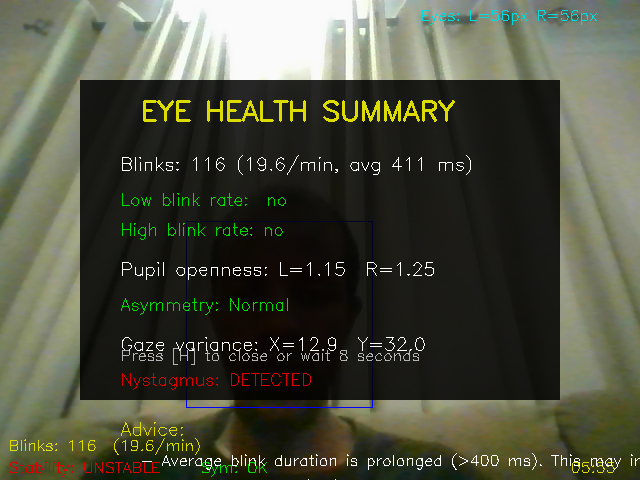
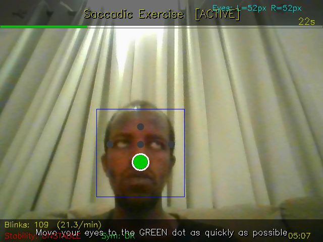
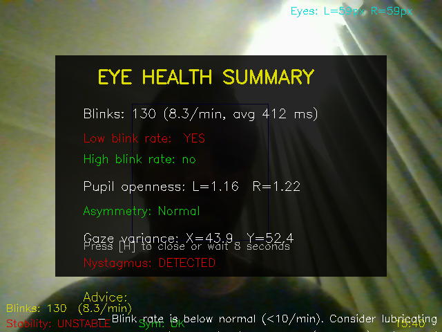
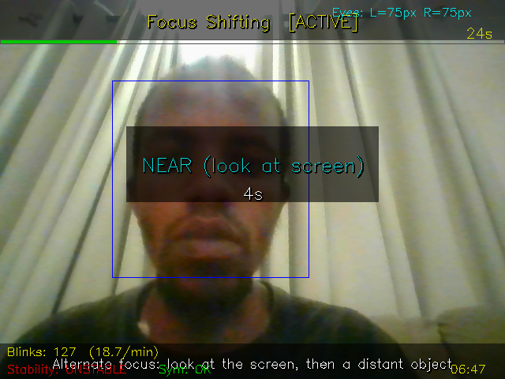

## eyeLike
An OpenCV based webcam gaze tracker based on a simple image gradient-based eye center algorithm by Fabian Timm, extended with **eye health monitoring**, **guided eye exercises**, and **session logging**.

## Features

### Eye Health Monitoring (automatic)
- **Blink detection** — rolling Y-position variance flags each blink; tracks blink rate (normal: 15–20/min) and average blink duration.
- **Gaze-stability / nystagmus detection** — rolling position variance over 30 frames flags high-frequency oscillations.
- **Eye-openness asymmetry** — compares left/right pupil Y-fraction within the eye ROI; flags ptosis-like differences.
- **Plain-language advice** — printed on demand with `[h]`, e.g. *"Blink rate below normal — consider lubricating eye drops."*

### Eye Exercise Module (press `[e]` to start)
| # | Exercise | Description |
|---|----------|-------------|
| 1 | **Saccadic** | Follow target dots that jump to 5 fixed positions (centre, left, right, up, down). Score = % frames on-target. |
| 2 | **Smooth Pursuit** | Track a dot moving in a figure-8 (Lissajous) pattern. Score = % frames on-target. |
| 3 | **Focus Shifting** | Alternate near/far focus on 10-second cues. |
| 4 | **Palming Rest** | 20-second countdown; close eyes and cup palms over them. |
| 5 | **20-20-20 Reminder** | Triggered automatically every 20 minutes; 20-second look-away countdown. |

State machine: `IDLE → CALIBRATE (3 s) → EXERCISE (30 s) → REST (5 s) → RESULTS`

### Session Logging
- Timestamped CSV file created automatically (e.g. `session_2026-05-01_22-32-42.csv`).
- Per-frame rows: timestamp, left/right pupil X/Y, blink flag.
- Exercise results appended as comment rows.
- Full health report written on `[q]`.

## Screenshots

### Main Interface - Eye Tracking

*Real-time eye tracking with pupil detection, blink monitoring, and gaze stability metrics.*

### Eye Health Summary

*On-screen health summary showing blink rate, pupil symmetry, gaze stability, and personalized advice.*

### Exercise Mode

*Guided eye exercises with visual targets. Follow the green dots to complete the exercise.*

### Health Metrics Display

*Live health metrics overlay showing eye measurements and real-time status indicators.*

### Look Mode

*20-20-20 reminder mode - look at something 20 feet away for 20 seconds.*

## Controls
| Key | Action |
|-----|--------|
| `e` | Start the first exercise / advance to the next exercise |
| `h` | Print health summary to the console |
| `q` | Quit, save session CSV, print log path |
| `c` | Quit (no log save) |
| `f` | Save current frame as `frame.png` |

## DISCLAIMER
Eye tracking is approximate (no gaze calibration). Exercise scores reflect relative pupil movement within the detected face region. This tool is for wellness and vision-training purposes only and is **not** a medical device.

## Building

CMake is required to build eyeLike.

### OSX or Linux with Make
```bash
# do things in the build directory so that we don't clog up the main directory
mkdir build
cd build
cmake ../
make
./bin/eyeLike # the executable file
```

### On OSX with XCode
```bash
mkdir build
./cmakeBuild.sh
```
then open the XCode project in the build folder and run from there.

### On Windows
There is some way to use CMake on Windows but I am not familiar with it.

## Blog Article:
- [Using Fabian Timm's Algorithm](http://thume.ca/projects/2012/11/04/simple-accurate-eye-center-tracking-in-opencv/)

## Paper:
Timm and Barth. Accurate eye centre localisation by means of gradients.
In Proceedings of the Int. Conference on Computer Theory and
Applications (VISAPP), volume 1, pages 125-130, Algarve, Portugal,
2011. INSTICC.

(also see youtube video at http://www.youtube.com/watch?feature=player_embedded&v=aGmGyFLQAFM)
